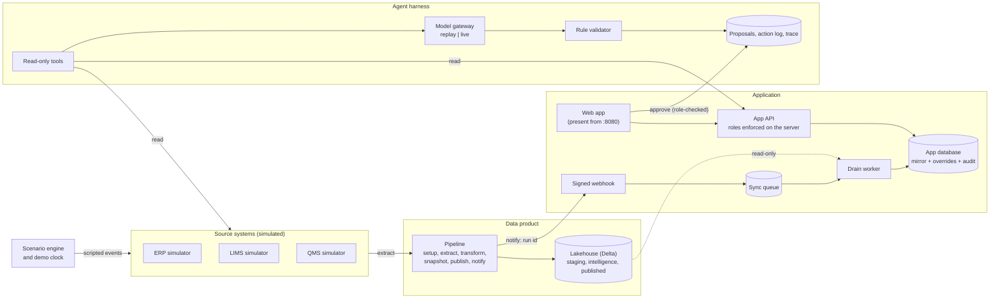

# Architecture overview

One page. The demo is a small, complete copy of a Receipt-to-Release stack: sources, a governed data product,
an application with audited human input, and agents that only propose. Details are in `specs/02-architecture.md`.

## How to read it

- **Facts** (stage, SLA, flags, weekly metrics) are derived by the pipeline from the source systems with fixed rules. No model, no randomness.
- **People** (adjusted dates, comments, status) live only in the application database, versioned and audited. They never flow back to the lakehouse or the sources.
- **Plan dates** (expected completion, colour) are computed when you look, from the facts, the human input and the demo clock, by one shared library.
- **Agents** read through read-only tools, draft a proposal, and a deterministic validator checks it. A person with the right role approves. Every step is traced.

## How this maps to a customer stack

| In the demo | In a customer stack | Notes |
|---|---|---|
| Lakehouse on a local volume (Delta tables, `staging`, `intelligence`, `published`) | Databricks (Unity Catalog, Delta) | Same table format and schemas. Transforms are written in the SQL subset that runs on both the demo's engine and Spark SQL |
| Pipeline (six steps) orchestrated by a workflow engine | Databricks Workflows or the customer's orchestrator | The six-step shape stays: setup, extract, transform, snapshot, publish, notify |
| ERP simulator (SAP-shaped tables and events) | SAP ECC or S/4HANA | Replaced by a source adapter; the profile names the fields |
| LIMS and QMS simulators | The customer's LIMS and QMS | One adapter each; the data contract stays the same |
| Scenario engine and demo clock | Not present | Demo only: scripted events and a clock that moves only when told |
| Application database, mirror and sync queue | A managed relational database on the customer's cloud | The queue is a table, so no extra broker to run |
| Webhook plus drain worker | The same, plus a scheduled safety poll | The safety poll is next (Tier 2) |
| Demo personas (a header) | The customer's single sign-on, groups mapped to the five roles | Roles are enforced on the server today; only the way the user is known changes |
| Model gateway: `replay` for the demo, `anthropic` for a live run | A managed model service in the customer's cloud account | Provider is a setting; prompts and the validator do not change |
| Site profile (YAML) | One profile per site | Stages, SLA days, teams, terms and reason codes are configuration, not code |
